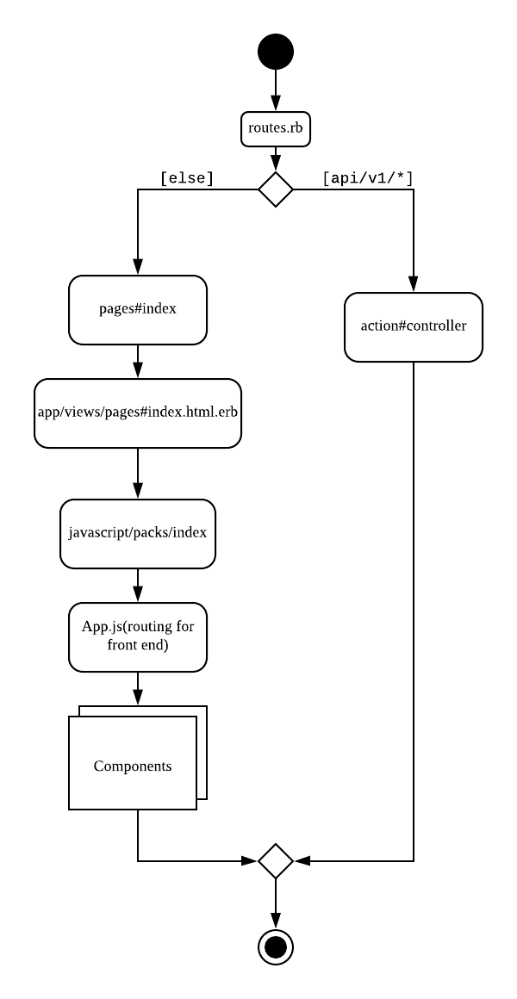

# Setting up environnement

## System Details
- Ruby 2.6.4
- Rails 6.01

## Steps
1. Use Use rbenv / rvm to install ruby whose version is as specified in Vantage root .ruby-version (2.6.4)
2. Install the specific rails version `gem install rails -v 6.0.1`
3. Install MySql. Refer to [here](https://stackoverflow.com/questions/3608287/error-installing-mysql2-failed-to-build-gem-native-extension) if you face installation issues.
```
# macOS
brew install  mysql

# Linux
sudo apt-get install mysql-client
```
4. Setup MySql with your own password
5. Install yarn `brew install yarn`
6. Set your password in a file, the rails database.yml file will read it from there to initiate a connection. [More info](https://github.com/bkeepers/dotenv). Create a .env file in the repo root and add the root passwords:
DB_... should point to your local database. By default the `DB_USERNAME = root` unless you made changes to it.

```
DB_USERNAME = root
DB_PASSWORD = ...
DB_HOST = 127.0.0.1
```
7. Start MySql server
8. Populate your dev and test databases by running both commands:
```
# Dev
rake db:setup

# Test
RAILS_ENV=test rake db:create db:schema:load
```
8. `rails s` to start the application

# Testing
We use `rspec` as our testing framework. Everything that has to do with testing is under the `spec` directory. Refer [here](https://rspec.info) for more information.
```
#Execute all test cases
bundle exec rspec

#Execute a particular file
rspec spec/models/user_spec.rb

#Excute a particular test case:{line number}
```

# Vantage - Developer Guide

## Design
Here contains the details of the design for the code base

### Architecture
Overall Architecture Diagram [here](https://www.lucidchart.com/invitations/accept/8ac1faaa-3a92-4ce8-938a-7c3cd39228a0).


### Routing
Activity diagram of how the routing works for the internal API and front end routes. Diragram [here](https://www.lucidchart.com/invitations/accept/8ac1faaa-3a92-4ce8-938a-7c3cd39228a0).



