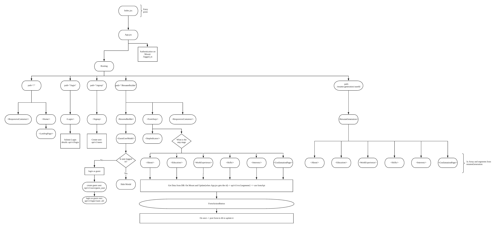
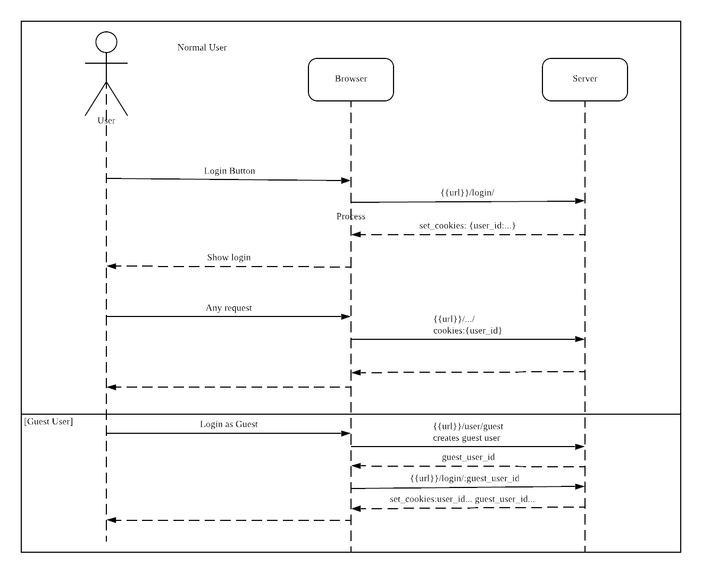

# Setting up environnement

## System Details
- Ruby 2.6.4
- Rails 6.01


## Steps 
1. Download docker cli
 ```
# Ubuntu
$ curl -fsSL https://download.docker.com/linux/ubuntu/gpg | sudo apt-key add -
$ sudo add-apt-repository "deb [arch=amd64] https://download.docker.com/linux/ubuntu $(lsb_release -cs) stable"
$ sudo apt-get update
$ apt-cache policy docker-ce
$ sudo apt-get install -y docker-ce

$ sudo curl -L https://github.com/docker/compose/releases/download/1.21.0/docker-compose-$(uname -s)-$(uname -m) -o /usr/local/bin/docker-compose
$ sudo chmod +x /usr/local/bin/docker-compose
```
### Instructions for docker installation on MAC

1. download docker app from [dockerhub](https://hub.docker.com/editions/community/docker-ce-desktop-mac)
2. That's all.

2. Run docker containers
```
docker-compose up
```

3. Create DB
```
$ docker-compose run --rm web rake db:setup db:migrate
```

## Steps(Local Machine)
1. Use Use rbenv / rvm to install ruby whose version is as specified in Vantage root .ruby-version (2.6.4)
2. Install the specific rails version `gem install rails -v 6.0.1`
3. Install MySql. Refer to [here](https://stackoverflow.com/questions/3608287/error-installing-mysql2-failed-to-build-gem-native-extension) if you face installation issues.
```
# macOS
brew install  mysql

# Linux
sudo apt-get install mysql-client
```
4. Setup MySql with your own password
5. Install yarn `brew install yarn`
6. Set your password in a file, the rails database.yml file will read it from there to initiate a connection. [More info](https://github.com/bkeepers/dotenv). Create a .env file in the repo root and add the root passwords:
DB_... should point to your local database. By default the `DB_USERNAME = root` unless you made changes to it.

```
DB_USERNAME = root
DB_PASSWORD = ...
DB_HOST = 127.0.0.1
```
7. Start MySql server
8. Populate your dev and test databases by running both commands:
```
# Dev
rake db:setup

# Test
RAILS_ENV=test rake db:create db:schema:load
```
8. `rails s` to start the application
9. `ruby bin/webpack-dev-server` to run webpacker for hot reload

## Deploying
1. Open Google Cloud VM console
2. `docker-compose -f docker-compose.prod.yml up -d mysql webserver`
3. `docker-compose -f docker-compose.prod.yml up -d --build --no-deps web`
4. `docker-compose -f docker-compose.prod.yml restart webserver`

If running app on the db for the first time execute the below command to start  
```
docker-compose -f docker-compose.prod.yml run web bundle exec rake db:setup db:migrate
```
### Common gotcha

1. Dont use our project uses yarn instead of `npm`. *Dont use `npm` commands*

# Testing

## Frontend
We use `jest` as our front end testing framework and `react-testing-library` for testing the components. All test front end cases are under the `spec/javascript` directory in root. Run `npm test` to execute all test cases. File needs to end with `_spec.js/jsx` to be identified by `jest`. 

Include this at the top of every file:
```
import React from 'react'
import { render, screen } from 'test-utils';
import '@testing-library/jest-dom/extend-expect'
import App from 'components/App.jsx'
```

## Backend
We use `rspec` as our testing framework. Everything that has to do with testing is under the `spec` directory. Refer [here](https://rspec.info) for more information.
```
#Execute all test cases
bundle exec rspec

#Execute a particular file
rspec spec/models/user_spec.rb

#Excute a particular test case:{line number}
```

# Vantage - Developer Guide

## Vantage-Resume-Spec(vrs)
This is Vantage own self-defined resume specification and it would be used to communicate the details of the resume between the front end and back end. Here is the format of the specification.

```
//VRS FORMAT
{
  "about": {
    "name": "USER'S FULL NAME: str",
    "email": "USER'S EMAIL: str",
    "contactNumber": "USER'S CONTACT NUMBER: int",
    "aboutMe": "SHORT WRITE UP OF USER: str"
  },
  "educations": [
    {
      "program": "EDUCATION PROGRAMME: str",
      "institution": "USER SCHOOL/ITE/PRIVATE SCHOOL ETC: str",
      "start": "EDUCATION START DATE: int(DDMMYYYY)",
      "end": "EDUCATION START DATE: int(DDMMYYYY)",
      "grade": "EDUCATION GRADE: str"
    }
  ],
  "workExperiences": [
    {
      "title": "JOB TITLE: str",
      "company": "COMPANY WORKING AT: str",
      "start": "EDUCATION START DATE: int(DDMMYYYY)",
      "end": "EDUCATION START DATE: int(DDMMYYYY)",
      "achievements": ["SHORT WRITE UP ABOUT ACHIEVEMENTS IN THE COMPANY"],
      "referee": {
        "name": "NAME OF REFEREE: str",
        "email": "EMAIL OF REFEREE: str"
      }
    }
  ],
  "skills": [
    {
      "name": "NAME OF SKILL: str",
      "description": "short write up about skill",
      "link": "External link to photo/video of the skill"
    }
  ],
  "interests": [
    {
      "name": "NAME OF INTEREST: str"
    }
  ]
}
```

## Design
Here contains the details of the design for the code base

### Architecture
Overall Architecture Diagram [here](https://www.lucidchart.com/invitations/accept/8ac1faaa-3a92-4ce8-938a-7c3cd39228a0).


#### Front end architecture

Refer to this link(https://www.lucidchart.com/invitations/accept/02422668-1633-4c88-9259-95ec849acf1c) to make any changes to the diagram




#### Routing
Activity diagram of how the routing works for the internal API and front end routes. Diragram [here](https://www.lucidchart.com/invitations/accept/8ac1faaa-3a92-4ce8-938a-7c3cd39228a0).

{ height=50% }

#### Authentication 


